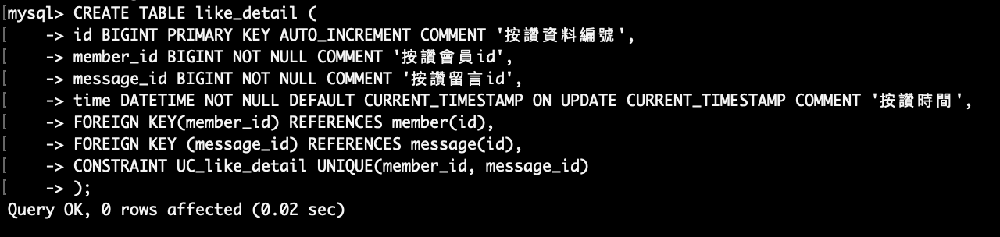
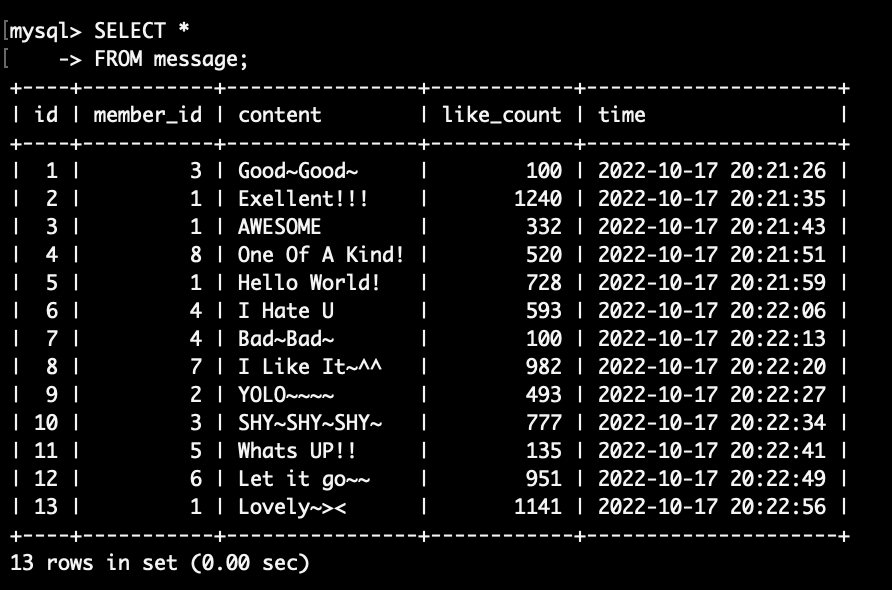
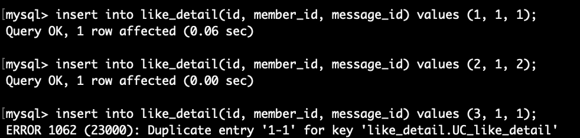
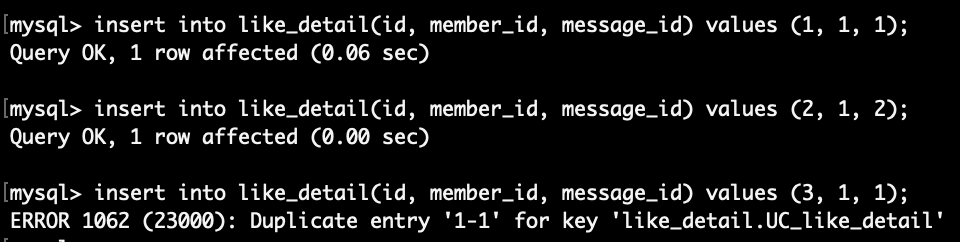

# week-5 作業

## 要求二

### 1.建立一個新的資料庫，取名字為 website。

&emsp;

### - 使用 website 資料庫。

&emsp;

### 2.在資料庫中，建立會員資料表，取名字為 member。

&emsp;

### - 修改COMMENT文字內容。

&emsp;

---

## 要求三

**1.使用INSERT指令新增資料至 member 資料表中。

&emsp;

### 2.使用 SELECT 指令取得所有在 member 資料表中的會員資料。

&emsp;

### 3.使用 SELECT 指令取得所有在 member 資料表中的會員資料，並按照 time 欄位，由近到遠排序。

&emsp;

- (加入列數便於檢視結果)

&emsp;

### 4.使用 SELECT 指令取得 member 資料表中第 2 ~ 4 共三筆資料，並按照 time 欄位，由近到遠排序。

&emsp;

- (加入列數便於檢視結果)

&emsp;

### 5.使用 SELECT 指令取得欄位 username 是 test 的會員資料。

&emsp;

- (為了優化搜尋效能，所以有補加 username 的 INDEX)

&emsp;

### 6.使用 SELECT 指令取得欄位 username 是 test 且欄位 password 也是 test 的資料。

&emsp;

### 7.使用 UPDATE 指令更新欄位 username 是 test 的會員資料，將資料中的 name 欄位改成 test2。

&emsp;

---

## 要求四

### 1.取得 member 資料表中，總共有幾筆資料 ( 幾位會員 )。

&emsp;

### 2.取得 member 資料表中，所有會員 follower_count 欄位的總和。

&emsp;

### 3.取得 member 資料表中，所有會員 follower_count 欄位的平均數。

&emsp;

---

## 要求五

### 1.建立 message 資料表**

&emsp;

- 使用 INSERT 指令將資料新增至 message 資料表中。

&emsp;

### 2.使用 SELECT 搭配 JOIN 語法，取得所有留言，結果須包含留言者會員的姓名。

&emsp;

### 3.使用 SELECT 搭配 JOIN 語法，取得 member 資料表中欄位 username 是 test 的所有留言，資料中須包含留言者會員的姓名。

&emsp;

### 4.使用 SELECT、SQL Aggregate Functions 搭配 JOIN 語法，取得 member 資料表中欄位 username 是 test 的所有留言平均按讚數。

&emsp;

---

## EXTRA:

### 紀錄每一個留言的按讚會員是誰，並支援以下使用場合：

- 可以根據留言編號取得該留言有哪些會員按讚。
- 會員若是嘗試對留言按讚：要能先檢查是否曾經按過讚，然後才將按讚的數量 +1 並且記錄按讚的會員是誰。
&emsp;

### 1.建立 like_detail 資料表，以紀錄會員對留言的按讚紀錄，並對’按讚會員id‘及‘按讚留言id’設定UNIQUE限制，使得同一會員無法對同一則留言重複按讚

&emsp;

- (為了優化搜尋效能，所以有補加 member_id 跟 message_id 的 INDEX)

&emsp;
 
 ### 2.建立 trigger ，使 like_detail 資料表可以與 message 資料表進行連動，當 like_detail 資料表成功新增一筆資料，message 資料表中對應留言編號的按讚數會自動 +1
 
&emsp;

 ### 3.對 like_detail 資料表新增資料，結果符合預期，無法新增同會員重複按讚同一則留言的資料，且新增成功後，message 資料表中對應留言的讚數連動增加
 - 新增資料到 like_detail 資料表前，message 資料表的讚數，第一、二則留言讚數分別為： 100, 1024
 
&emsp;

 - 新增資料到 like_dtail，可以看到資料表能成功新增同一會員對不同留言按讚的資料，但如果新增同一會員對同一留言按讚的資料，則會新增失敗
 
&emsp;

  - 新增資料到 like_detail 資料表後，message 資料表的讚數，可以看到第一、二則留言讚數皆增加1，分別為: 101, 1025
 
 &emsp;

---

### ERD (Entity Relationship Diagram)

&emsp;

---

### 使用 mysqldump 匯出資料

