# week-5 作業

## 要求二

### 1.建立一個新的資料庫，取名字為 website。

&emsp;

### - 使用 website 資料庫。

&emsp;

### 2.在資料庫中，建立會員資料表，取名字為 member。

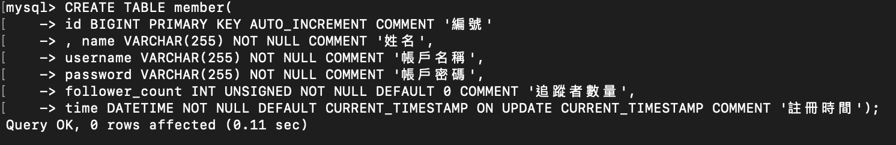
&emsp;

### - 修改COMMENT文字內容。

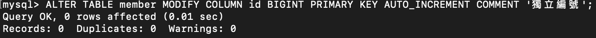
&emsp;

---

## 要求三

**1.使用INSERT指令新增資料至 member 資料表中。

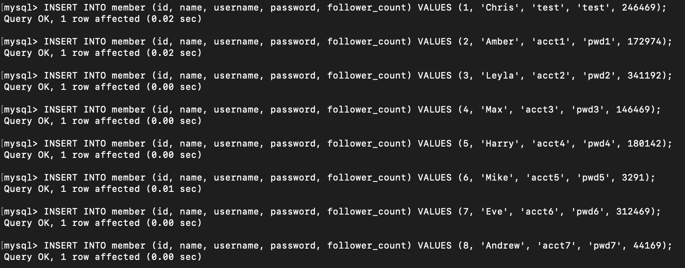
&emsp;

### 2.使用 SELECT 指令取得所有在 member 資料表中的會員資料。

&emsp;

### 3.使用 SELECT 指令取得所有在 member 資料表中的會員資料，並按照 time 欄位，由近到遠排序。

&emsp;

- (加入列數便於檢視結果)

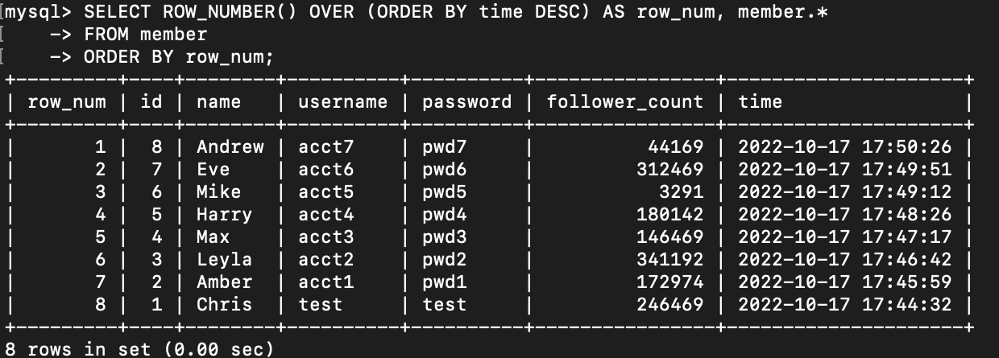
&emsp;

### 4.使用 SELECT 指令取得 member 資料表中第 2 ~ 4 共三筆資料，並按照 time 欄位，由近到遠排序。

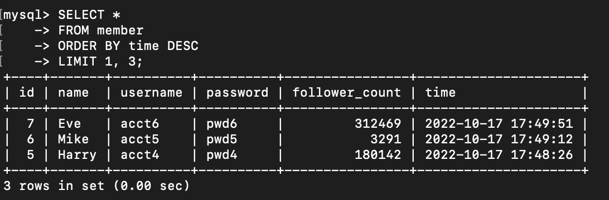
&emsp;

- (加入列數便於檢視結果)

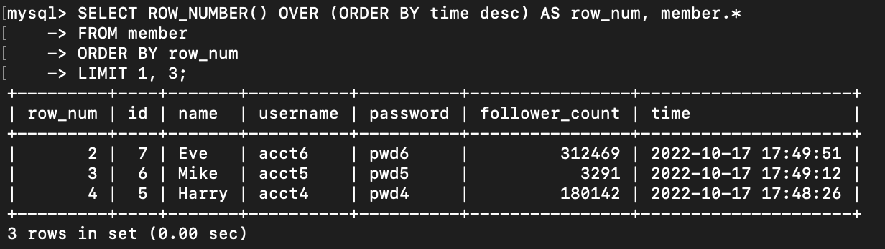
&emsp;

### 5.使用 SELECT 指令取得欄位 username 是 test 的會員資料。

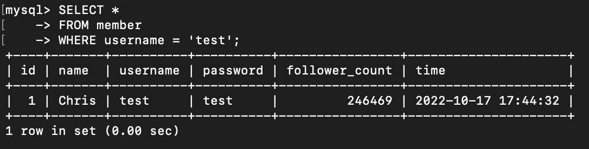
&emsp;

- (為了優化搜尋效能，所以有補加 username 的 INDEX)

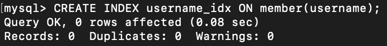
&emsp;

### 6.使用 SELECT 指令取得欄位 username 是 test 且欄位 password 也是 test 的資料。

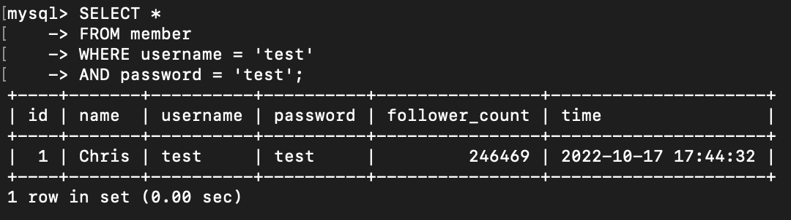
&emsp;

### 7.使用 UPDATE 指令更新欄位 username 是 test 的會員資料，將資料中的 name 欄位改成 test2。

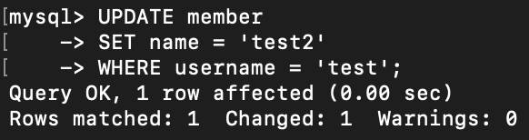
&emsp;

---

## 要求四

### 1.取得 member 資料表中，總共有幾筆資料 ( 幾位會員 )。

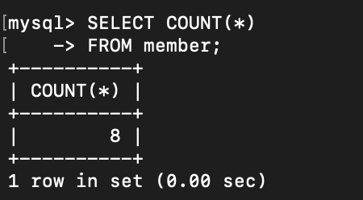
&emsp;

### 2.取得 member 資料表中，所有會員 follower_count 欄位的總和。

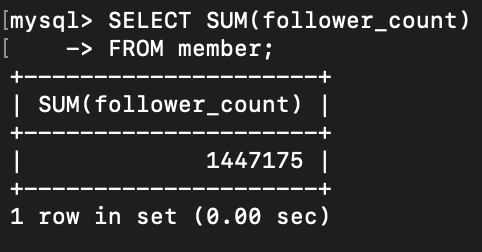
&emsp;

### 3.取得 member 資料表中，所有會員 follower_count 欄位的平均數。

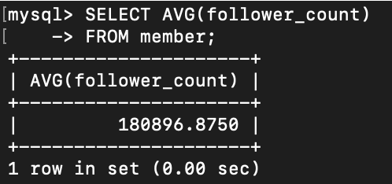
&emsp;

---

## 要求五

### 1.建立 message 資料表**

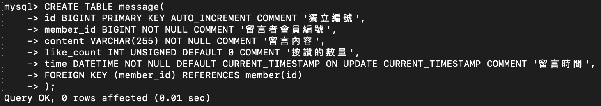
&emsp;

- 使用 INSERT 指令將資料新增至 message 資料表中。

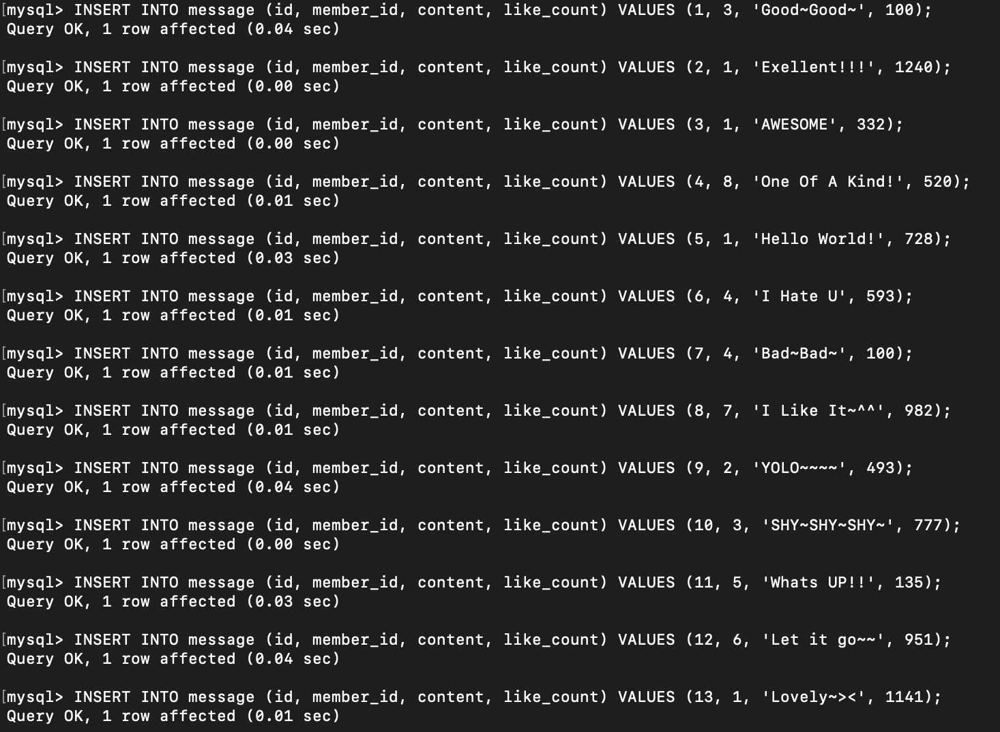
&emsp;

### 2.使用 SELECT 搭配 JOIN 語法，取得所有留言，結果須包含留言者會員的姓名。

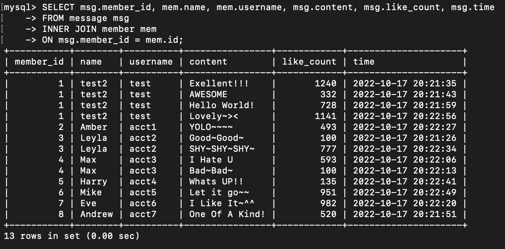
&emsp;

### 3.使用 SELECT 搭配 JOIN 語法，取得 member 資料表中欄位 username 是 test 的所有留言，資料中須包含留言者會員的姓名。

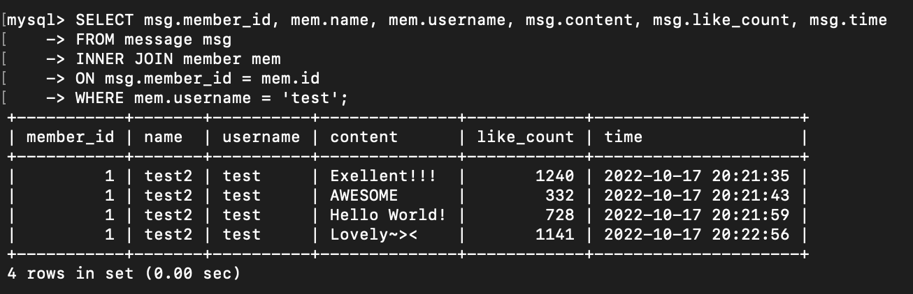
&emsp;

### 4.使用 SELECT、SQL Aggregate Functions 搭配 JOIN 語法，取得 member 資料表中欄位 username 是 test 的所有留言平均按讚數。

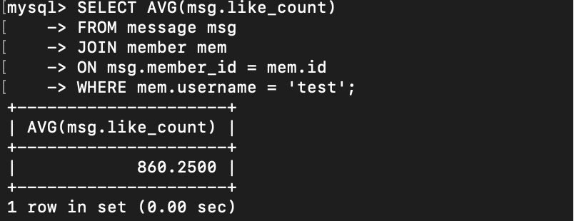
&emsp;

### 使用 mysqldump 匯出資料

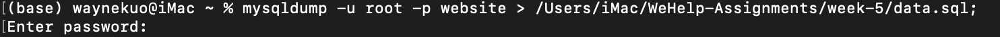